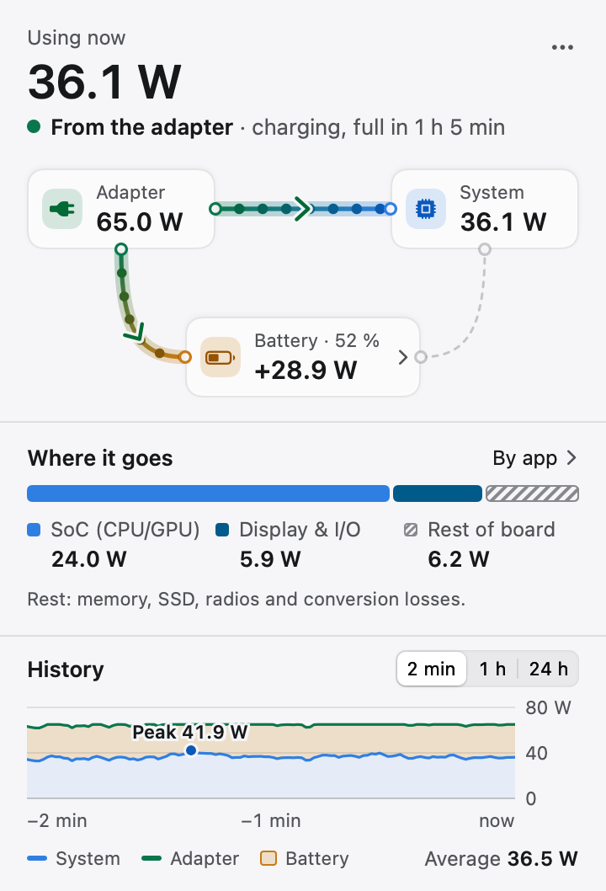
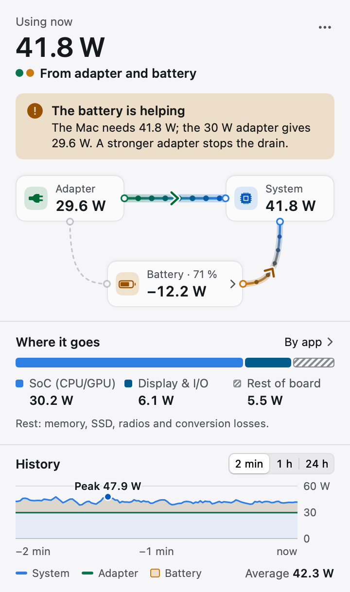
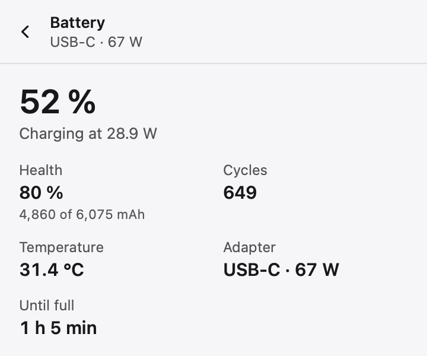
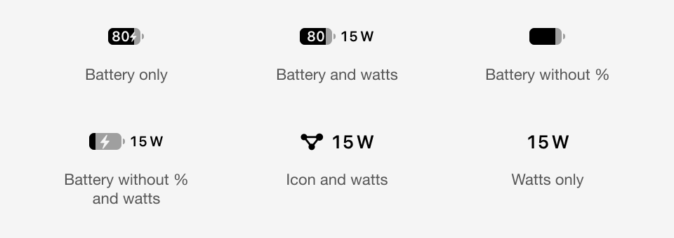
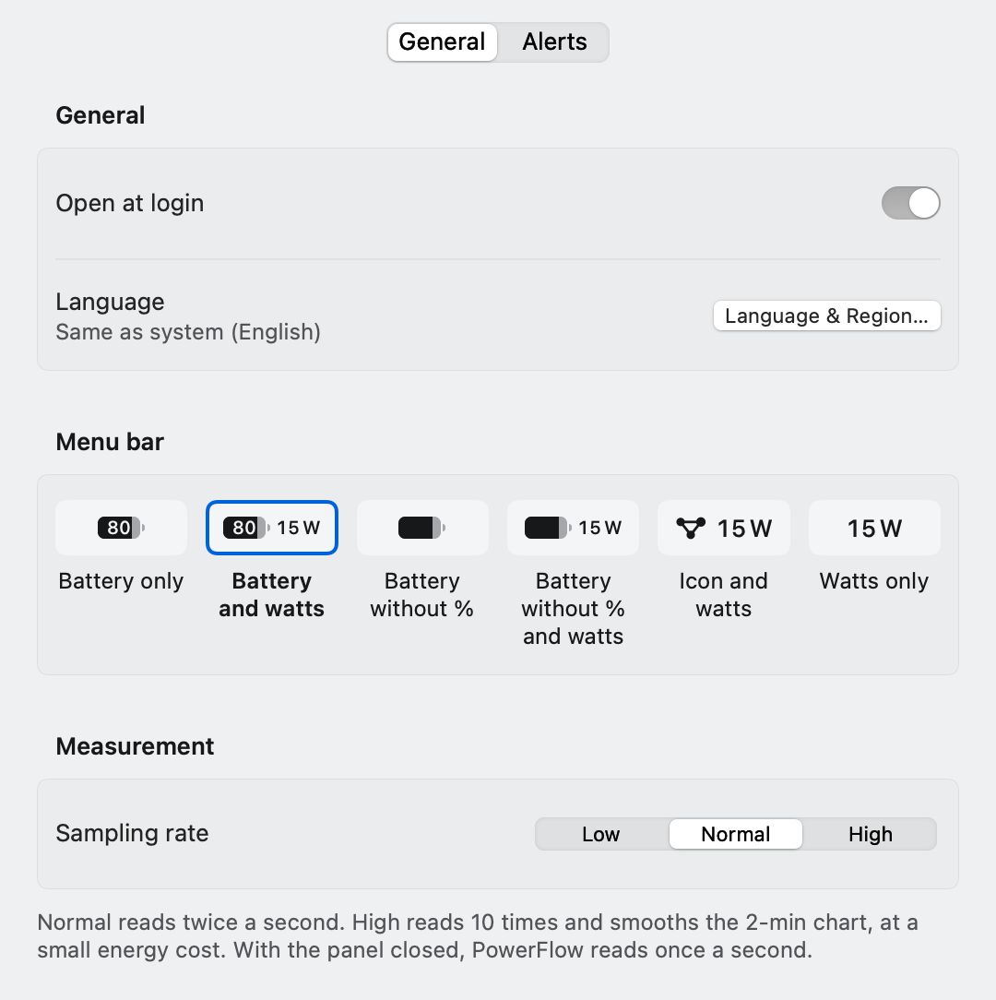
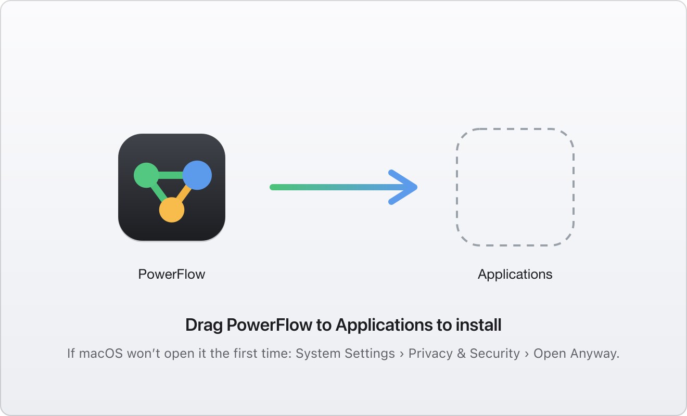
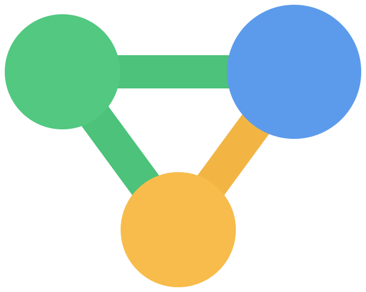

<div align="center">

<picture>
  <source media="(prefers-color-scheme: dark)" srcset="brand/logo-dark.svg">
  <source media="(prefers-color-scheme: light)" srcset="brand/logo-light.svg">
  
</picture>

<br><br>

**See where your Mac's power goes, in watts.**

A menu bar app for Apple Silicon · adapter, battery and system at a glance · it only reads sensors.

<br>


[](LICENSE)
[](https://github.com/e271aa/power-flow/actions/workflows/ci.yml)

</div>

---

## What is PowerFlow?

PowerFlow shows, in real time, where your Mac's power goes: how much comes in
through the adapter, how much goes into the battery or comes out of it, how
much the system uses, and which part of the system uses it.

It is for people with an Apple Silicon Mac who are curious about what their
machine is drawing, or who want to understand their battery. You use it in two
ways:

- **At a glance**, in the menu bar: how much you are using right now.
- **When something looks wrong**: charging is slow, the battery drops with the
  cable plugged in, the fans spin up. Open the panel to see where the power
  comes from, where it goes, and why.

It is **not** a charge limiter and **not** a general system monitor. It does
one thing: the flow of power, in watts.

> **It only reads.** PowerFlow never changes how the battery charges. It needs
> no password, no account and no network. What it cannot measure directly is
> labelled as a remainder or an estimate, and a missing reading is never shown
> as zero.

<div align="center">
<br>
<picture>
  <source media="(prefers-color-scheme: dark)" srcset="assets/panel-dark.png">
  <source media="(prefers-color-scheme: light)" srcset="assets/panel-light.png">
  
</picture>
</div>

## Features

| | |
|---|---|
| **Live flow** | Adapter, battery and system as a diagram, with watts on each node. A link's thickness is the flow and its arrow the direction, so it reads without animation. |
| **Where it goes** | The system total split into SoC (CPU and GPU), display & I/O, and the rest of the board. The rest is computed, not measured, and says so. |
| **Energy by app** | The top five apps over the last five minutes, plus "System & other". Per-app values are estimates and are marked as such. |
| **Battery** | Charge, health, cycles, temperature, adapter, time to full or time left, and why it is not charging. |
| **The battery is helping** | When the adapter cannot keep up, the panel says so in plain words: what the Mac needs, what the adapter gives, and what to do. |
| **History** | 2 minutes, 1 hour and 24 hours. The last 24 hours are kept on disk, so quitting does not lose them. |
| **Alerts** | Optional notifications when the battery backs up the adapter, when the battery gets hot, or when the adapter is too weak to charge. |
| **Menu bar** | Six layouts, from the battery alone to watts only. |
| **Settings** | Open at login, menu bar layout, sampling rate and alerts. |
| **Light, dark and high contrast** | Follows the system, including Increase Contrast and Reduce Motion. |
| **English and Portuguese** | Follows the system language. |

<table>
  <tr>
    <td valign="top" width="50%">
      <picture>
        <source media="(prefers-color-scheme: dark)" srcset="assets/assist-dark.png">
        <source media="(prefers-color-scheme: light)" srcset="assets/assist-light.png">
        
      </picture>
    </td>
    <td valign="top" width="50%">
      <picture>
        <source media="(prefers-color-scheme: dark)" srcset="assets/battery-dark.png">
        <source media="(prefers-color-scheme: light)" srcset="assets/battery-light.png">
        
      </picture>
    </td>
  </tr>
  <tr>
    <td align="center">The battery helping a weak adapter</td>
    <td align="center">Battery details</td>
  </tr>
</table>

### The menu bar item

<div align="center">
<picture>
  <source media="(prefers-color-scheme: dark)" srcset="assets/menubar-dark.png">
  <source media="(prefers-color-scheme: light)" srcset="assets/menubar-light.png">
  
</picture>
</div>

The battery is drawn like the system one, with the charge inside and a bolt
when the cable is in. On a Mac without a battery, the item shows watts. Click
it to open the panel; right-click for Settings, About and Quit.

### Settings

<div align="center">
<picture>
  <source media="(prefers-color-scheme: dark)" srcset="assets/settings-dark.png">
  <source media="(prefers-color-scheme: light)" srcset="assets/settings-light.png">
  
</picture>
</div>

### Designed for

- **Apple Silicon Macs on macOS 13 or later.** MacBooks, and Macs without a
  battery (Mac mini, Mac Studio): there the battery node and battery details
  are left out.
- **One number first.** What you are using now, and where it comes from, read
  before anything else.
- **Not costing what it measures.** With the panel closed there is no
  animation and no redrawing, and PowerFlow reads once a second. With the
  panel open, the animation is capped at 30 fps. The menu bar title changes
  at most every 2 seconds.
- **Honesty about what is not measured.** The rest of the board, "System &
  other" and per-app values are labelled as remainders or estimates.
- **Reading it still.** The direction and size of every flow show without
  motion and without relying on colour alone. Every node and flow has a
  VoiceOver label.

## How it measures

| Reading | Source |
|---|---|
| System total, adapter input, SoC, display & I/O | Power keys of the System Management Controller (SMC), read through the AppleSMC user client |
| Battery charge, health, cycles, voltage, current, temperature, adapter, reason for not charging | The IORegistry (`AppleSmartBattery`) |
| Energy by app | `proc_pid_rusage`: the CPU energy the kernel assigns to each process where the Mac reports it, otherwise CPU time weighted by SoC power |
| Rest of the board | System total minus SoC minus display & I/O |
| System & other | System total minus the sum of the apps |

Everything is read-only, without admin rights and without network access. The
24-hour history is stored on your Mac, in
`~/Library/Application Support/PowerFlow/history.json`.

The SMC keys are not documented by Apple and differ between chip generations.
PowerFlow was calibrated on an M1 Pro and tries a list of candidate keys for
each reading. If a reading does not exist on your Mac, that part of the
diagram is hidden instead of showing a zero. `--dump` and `--dump-keys` (below)
show what your Mac reports.

## Tech stack

| Layer | Choice |
|---|---|
| Language | Swift 5.9 (Swift 5 language mode), plus a small C module for the SMC |
| UI | AppKit (`NSStatusItem`, `NSPopover`) and SwiftUI |
| Sensors | IOKit: AppleSMC and the IORegistry; `libproc` for per-app energy |
| Build | Swift Package Manager and `build.sh`, no Xcode project |
| Tests | XCTest for the core, plus a self-test that every build runs on the app bundle |
| App icon | `brand/AppIcon.svg`, rendered with `rsvg-convert` and packed with `iconutil` |
| Disk image | [`dmgbuild`](https://github.com/dmgbuild/dmgbuild), with the background from `dmg/background.svg` |
| CI | GitHub Actions on macOS: tests and app build on every push |

## Project structure

```
.
├── Sources/
│   ├── CSMC/                C bridge to the AppleSMC user client
│   ├── PowerFlowCore/       Sensors, model, history, alerts and strings (no UI)
│   └── PowerFlow/           The app: menu bar item, panel and settings (AppKit + SwiftUI)
├── Tests/PowerFlowCoreTests/  XCTest suite for the core
├── brand/                   Logo, symbol and app icon
├── assets/                  README images, rendered by the app
├── dmg/                     Disk image background and layout
├── build.sh                 Builds, signs (ad hoc) and checks PowerFlow.app; --dmg also makes the disk image
└── .github/workflows/       CI
```

All logic that can be tested lives in `PowerFlowCore`. The views in
`PowerFlow` only present the states they receive.

## Getting started

### Install from the disk image

<div align="center">

</div>

1. Download `power-flow.dmg`.
2. Open it and drag **PowerFlow** onto **Applications**.
3. Open PowerFlow from Applications. It is signed ad hoc and not notarized, so
   the first time macOS will not open it. Go to **System Settings › Privacy &
   Security**, click **Open Anyway** next to the message about PowerFlow, and
   confirm. You only do this once.

PowerFlow lives in the menu bar; it has no Dock icon and no main window. On
first launch it opens the panel with a short explanation. Turn on **Open at
login** in Settings to have it start with your session.

### Build from source

Requirements: an Apple Silicon Mac with macOS 13 or later, the Xcode Command
Line Tools (Swift 5.9 or newer) and `rsvg-convert` for the icon:

```bash
xcode-select --install
brew install librsvg
```

Then:

```bash
git clone https://github.com/e271aa/power-flow.git
cd power-flow
swift test            # unit tests
./build.sh            # builds, signs and self-tests PowerFlow.app
./build.sh --dmg      # also builds power-flow.dmg
```

The first `./build.sh --dmg` installs `dmgbuild` into a virtual environment
inside `.build/`, so that run needs Python 3 and a network connection.

## Commands

The app binary doubles as a diagnostic tool. Run these from the repository
after `./build.sh`; the diagnostic output is in Portuguese.

```bash
B=PowerFlow.app/Contents/MacOS/PowerFlow
```

| Command | What it does |
|---|---|
| `$B --selftest` | Model checks (also run by `build.sh`) |
| `$B --dump` | The SMC keys in use, the current flow and the battery |
| `$B --dump-keys` | Every SMC power key on this Mac, with its value |
| `$B --dump-history` | What is stored from the last 24 hours |
| `$B --dump-apps 10` | Energy per app every 5 seconds for 10 seconds, checked against the system total |
| `$B --watch 10` | The flow, one line per second, for 10 seconds |
| `$B --login-item` | Whether PowerFlow opens at login |
| `$B --diagnose` | Whether the menu bar item exists, its width and where it is on screen |
| `$B --snapshot panel.png` | Renders the panel to a PNG without opening a window |
| `$B --icon-preview bar.png` | The menu bar item in every layout, at 1×, 2× and 8×, light and dark |

`--snapshot` takes options to render any state of the panel:

| Option | Values |
|---|---|
| `--state` | `charging`, `optimized`, `temperature`, `weak`, `assist`, `battery`, `nobattery`, `unavailable`, `warming` |
| `--appearance` | `light`, `dark`, `hc-light`, `hc-dark` |
| `--view` | `main`, `battery`, `apps`, `history`, `settings` |
| `--period` | `2m`, `1h`, `24h` |
| `--reduce-motion` | Renders without the flow particles |

The panel images in this README were made this way, for example:

```bash
$B --snapshot panel-dark.png --state charging --appearance dark -AppleLanguages "(en)" -AppleLocale en_US
```

`-AppleLanguages "(en)"` and `-AppleLocale en_US` force English text and
number formats; without them the app follows the system.

## Brand

The mark is the **three nodes** of the flow: the adapter (green), the system
(blue) and the battery (amber), joined by the links power travels along. It is
the app icon and, in one colour, the "Icon and watts" layout of the menu bar.

<div align="center">
<br>

<br><br>
</div>

| Colour | Hex |
|---|---|
| Adapter | `#4CC27A` link · `#52C881` node |
| System | `#5C9BEB` |
| Battery | `#F2B544` link · `#F7BC4B` node |
| Icon background | `#40434A` to `#1B1D21` |
| Wordmark | `#1D1D1F` on light · `#F5F5F7` on dark |

Logo, symbol, one-colour versions and the icon at 1024 px are in
[`brand/`](brand/README.md).

## License

MIT, see [LICENSE](LICENSE).
